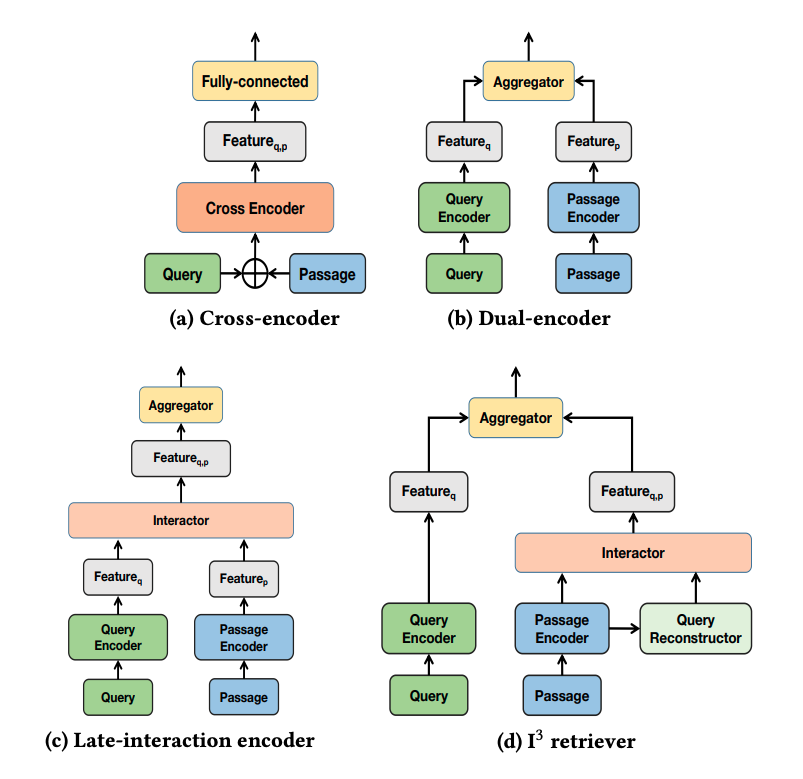

## Learning to Rank

### [Unified Off-Policy Learning to Rank: a Reinforcement Learning Perspective](https://arxiv.org/pdf/2306.07528.pdf) (2023)

> In this paper, we unified the ranking process under general stochastic click models as a Markov Decision Process (MDP), and the optimal ranking
could be learned with offline reinforcement learning (RL) directly.

> Our key insight is that the user’s examination and click behavior
summarized by click models has a Markov structure ...
Specifically, the learning to rank problem
now can be viewed as an episodic RL problem [45, 1], where each time step corresponds to a
ranking position, each action selects a document for the position, and the state captures the user’s
examination tendency.
...
We first construct each logged query and ranking data as an episode of reinforcement learning following the MDP formulation. Our dedicated structure for state representation
learning can efficiently capture the dependency information for examination and click generation,
e.g. ranking position in PBM and previous documents in CM and DCM. The algorithm jointly learns
state representation and optimizes the policy, where any off-the-shelf offline RL algorithm can be
applied as a plug-in solver. 

---
### [I3 Retriever: Incorporating Implicit Interaction in Pre-trained Language Models for Passage Retrieval](https://arxiv.org/pdf/2306.02371.pdf) (CIKM 2023)

> studies have
found that the performance of dual-encoders are often limited due
to the neglecting of the interaction information between queries
and candidate passages.
...
recent state-of-the-art methods often introduce late-interaction during the model inference process. However,
such late-interaction based methods usually bring extensive computation and storage cost on large corpus. 
...
we Incorporate Implicit Interaction
into dual-encoders, and propose I
3
retriever. In particular, our implicit interaction paradigm leverages generated pseudo-queries to
simulate query-passage interaction, which jointly optimizes with
query and passage encoders in an end-to-end manner.

>  Unlike existing interaction schemes that requires
explicit query text as input, the implicit interaction is conducted
between a passage and the pseudo-query vectors generated from the
passage. Note that the generated pseudo-query vectors are implicit
(i.e., latent) without explicit textual interpretation. Such implicit
interaction paradigm is appealing, as 1) it is fully decoupled from
actual query, and thus allows high online efficiency with offline
caching of passage vectors, and 2) compared with using an off-theshelf generative model [[41]](https://cs.uwaterloo.ca/~jimmylin/publications/Nogueira_Lin_2019_docTTTTTquery-v2.pdf) to explicitly generate textual pseudoquery, our pseudo-query is represented by latent vectors that are
jointly optimized with the dual-encoder backbone, which is more
expressive for the downstream retrieval task.

---
### [RUEL: Retrieval-Augmented User Representation with Edge Browser Logs for Sequential Recommendation](https://paperswithcode.com/paper/ruel-retrieval-augmented-user-representation) (2023)

> we propose RUEL, a novel retrieval-based sequential recommender that can effectively incorporate external anonymous user behavior data.
...
We then design a contrastive learning framework with a momentum encoder and a memory bank to retrieve the most relevant and diverse browsing sequences from the full browsing log based on the semantic similarity between user representations. After retrieval, we apply an item-level attentive selector to filter out noisy items and generate refined sequence embeddings for the final predictor. 

> TBC

---
### [Recommender Systems with Generative Retrieval](https://shashankrajput.github.io/Generative.pdf) (2023)

> we
create semantically meaningful tuple of codewords to serve as a Semantic ID for
each item. 
Given Semantic IDs for items in a user session, a Transformer-based
sequence-to-sequence model is trained to predict the Semantic ID of the next
item that the user will interact with

> TBC

---

### [RAVEN: In-Context Learning with Retrieval Augmented Encoder-Decoder Language Models](https://arxiv.org/pdf/2308.07922.pdf) (2023)

> TBC

---

### [MAKING RETRIEVAL-AUGMENTED LANGUAGE MODELS ROBUST TO IRRELEVANT CONTEXT](https://arxiv.org/pdf/2310.01558v1.pdf) (2023)

> TBC

---

### [RETRIEVAL MEETS LONG CONTEXT LARGE LANGUAGE MODELS](https://arxiv.org/pdf/2310.03025.pdf) (2023)

> TBC

---

### [UNDERSTANDING RETRIEVAL AUGMENTATION FOR LONG-FORM QUESTION ANSWERING](https://arxiv.org/pdf/2310.12150.pdf) (2023)

> TBC

---

### [RET-LLM: Towards a General Read-Write Memory for Large Language Models](https://arxiv.org/pdf/2305.14322.pdf) (2023)

> TBC

---

### [Shall We Pretrain Autoregressive Language Models with Retrieval? A Comprehensive Study](https://arxiv.org/pdf/2304.06762.pdf) (2023)

> TBC

---

### [In-Context Retrieval-Augmented Language Models](https://uploads-ssl.webflow.com/60fd4503684b466578c0d307/63c6c20dec4479564db21819_NEW_In_Context_Retrieval_Augmented_Language_Models.pdf) (2023)

> TBC

---

### [RecMind: Large Language Model Powered Agent For Recommendation](https://arxiv.org/pdf/2308.14296.pdf) (2023)

> TBC

---

### [Generative Slate Recommendation with Reinforcement Learning](https://arxiv.org/pdf/2301.08632.pdf) (2023)

> TBC

---

### [Do LLMs Understand User Preferences? Evaluating LLMs On User Rating Prediction](https://arxiv.org/pdf/2305.06474.pdf) (2023)

> TBC

---

### [LlamaRec: Two-Stage Recommendation using Large Language Models for Ranking](https://arxiv.org/pdf/2311.02089.pdf) (2023)

> TBC

---

### [Integrating Summarization and Retrieval for Enhanced Personalization via Large Language Models](https://arxiv.org/pdf/2310.20081v1.pdf) (2023)

> TBC

