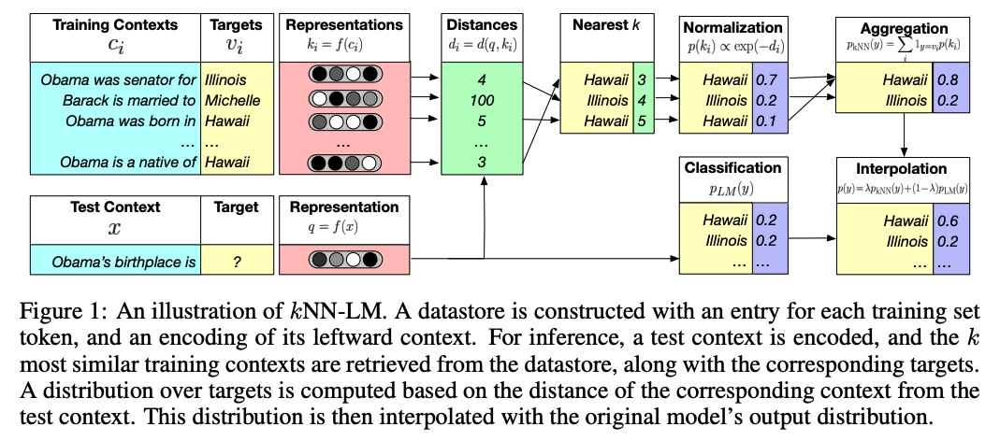

---
### [Measuring and Narrowing the Compositionality Gap in Language Models](https://arxiv.org/pdf/2210.03350.pdf) (2023)

> We measure how often models can correctly answer all
sub-problems but not generate the overall solution, a ratio we call the *compositionality gap*.
... In the GPT-3 family
of models, as model size increases we show that
the single-hop question answering performance
improves faster than the multi-hop performance
does, therefore the compositionality gap does
not decrease. 
... while more powerful models memorize and
recall more factual knowledge, they show no
corresponding improvement in their ability to
perform this kind of compositional reasoning.

> We
present a new method, self-ask, that further improves on chain of thought. In our method,
the model explicitly asks itself (and answers)
follow-up questions before answering the initial question.

> we find that the compositionality gap remains at a roughly constant 40% between different
model sizes and training techniques, with no apparent improvement from scale 

> as the perplexities assigned to
correct sub-question answers decrease (i.e., the
model becomes more confident about the correct
answers), the probability of answering the compositional question correctly increases. For example,
when the maximal perplexity assigned to the correct sub-question answer (i.e., assigned to the correct answer that the model is less confident about
of the two sub-questions) is between 1.232 and
6.738, the model answers 42.6% of the compositional question correctly. However, when the maximal perplexity is between 1.000 and 1.002, the
model answers 81.1% of the compositional question correctly. We observed a similar pattern when
sorting sub-question pairs by average instead of
worse perplexity.
Being able to answer a 1-hop question correctly
in a prompt containing similar 1-hop questions does
not mean that the model has fully “learned” the
given fact. Our results indicate that a model can
compose facts at a much higher rate when it can recall these facts more confidently.

> additionally reporting the perplexity assigned to the correct answer
might be a better way to evaluate LMs on downstream question answering tasks as opposed to just
reporting accuracy. Concurrent papers (Srivastava
et al., 2022; Wei et al., 2022a) recently advocate for
this, but from a different perspective. They show
evidence that as model size scales, cross-entropy
loss can indicate an improvement on downstream
task performance even when actual task metrics
(i.e., accuracy) do not improve.

> Self-ask (depicted in Figure 2) requires a one- or
few-shot prompt that demonstrates how to answer
the questions. Our prompt starts with those examples, after which we append the inference-time
question. We then insert the phrase “Are follow up
questions needed here:” at the end of the prompt
since we found that doing so slightly improves results.4 The model then outputs a response. In most
cases it first outputs “Yes.”, meaning that follow-up
questions are necessary. The LM then outputs the
first follow-up question, answers it, and continues
asking and answering follow-up questions until it
decides it has sufficient information; at this point,
it outputs “So the final answer is:” before providing the final answer

> Self-ask improves over chain of thought
by smaller margins on 2WikiMultiHopQA and
Musique but by a large 11% (absolute) on Bamboogle. We hypothesize that the much more varied nature of Bamboogle, and the fact that most
questions are not similar to those in the few-shot
prompt, might make it harder for chain of thought
to decompose the questions, whereas our self-ask
model, which explicitly decomposes questions before answering them, deals much better with novel
inference questions. 

---
### [LLaMA: Open and Efficient Foundation Language Models](https://arxiv.org/pdf/2302.13971.pdf) (2023)

> TBC

---
### [PaLM: Scaling Language Modeling with Pathways](https://arxiv.org/pdf/2204.02311.pdf) (2022)

> TBC

---
### [GENERALIZATION THROUGH MEMORIZATION: NEAREST NEIGHBOR LANGUAGE MODELS](https://arxiv.org/pdf/1911.00172.pdf) (2020) 

> We introduce kNN-LM, an approach that extends a pre-trained LM by linearly interpolating its next
word distribution with a k-nearest neighbors (kNN) model. The nearest neighbors are computed
according to distance in the pre-trained embedding space and can be drawn from any text collection, including the original LM training data. This approach allows rare patterns to be memorized
explicitly, rather than implicitly in model parameters.

> This can be done with a single forward pass over a text collection (potentially including the original
LM training set), where the resulting context-target pairs are stored in a key-value datastore that is
queried during inference.

> To search over this large datastore, we use FAISS (Johnson et al.,
2017), an open source library for fast nearest neighbor retrieval in high dimensional spaces. 

> A FAISS index is then created using 1M randomly sampled keys
to learn 4096 cluster centroids. For efficiency, keys are quantized to 64-bytes. During inference,
we retrieve k = 1024 neighbors, and the index looks up 32 cluster centroids while searching for
the nearest neighbors.

> retrieving nearest neighbors from the corpus outperforms training on it.

> performance monotonically improves as more neighbors are returned, and suggests that even larger
improvements may be possible with a higher value of k. Nonetheless, even a small number of
neighbors (k = 8) is enough to achieve a new state of the art.

> Interpolating the memorizing LM with the original LM improves validation perplexity by just 0.1
– compared to 1.9 from kNN-LM. This result suggests that although the Transformer is expressive
enough to memorize all training examples, learning to do so does not result in context representations
that generalize. In contrast, kNN-LM memorizes training data while improving generalization.

---
### [Test-Time Prompt Tuning for Zero-Shot Generalization in Vision-Language Models](https://proceedings.neurips.cc/paper_files/paper/2022/file/5bf2b802e24106064dc547ae9283bb0c-Paper-Conference.pdf) (2022)

> we propose test-time prompt tuning (TPT), a method that can learn
adaptive prompts on the fly with a single test sample. For image classification, TPT
optimizes the prompt by minimizing the entropy with confidence selection so that
the model has consistent predictions across different augmented views of each test
sample.

> TBC

---
### [Towards Revealing the Mystery behind Chain of Thought: A Theoretical Perspective](https://openreview.net/attachment?id=qHrADgAdYu&name=pdf) (NeurIPS 2023)

> TBC

---
### [Random-Access Infinite Context Length for Transformers](https://openreview.net/attachment?id=7eHn64wOVy&name=pdf) (NeurIPS 2023)

> TBC

---
### [LIMA: Less Is More for Alignment](https://proceedings.neurips.cc/paper_files/paper/2023/file/ac662d74829e4407ce1d126477f4a03a-Paper-Conference.pdf) (NeurIPS 2023)

> TBC

<!-- ---
###  ()

> TBC-->

<!-- ---
###  ()

> TBC-->

