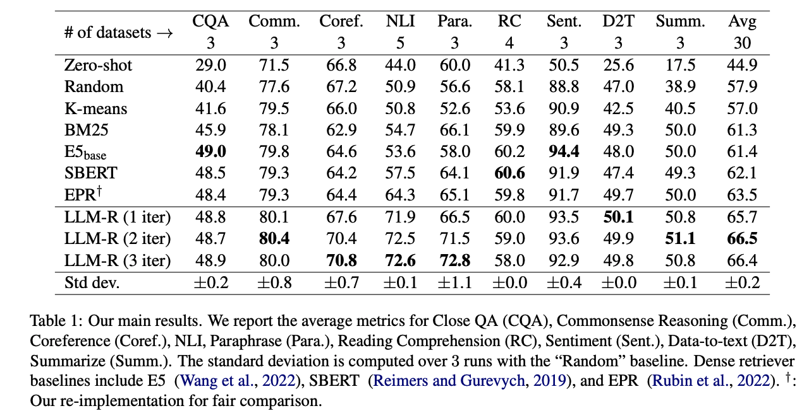

---

---
### [Efficient Prompting via Dynamic In-Context Learning](https://arxiv.org/pdf/2305.11170.pdf) (2023)

> we propose DYNAICL, a recipe for efficient
prompting with black-box generalist models that dynamically allocate in-context
examples according to the input complexity and the computational budget.
...
we train a meta controller that predicts the number of in-context
examples suitable for the generalist model to make a good prediction based on
the performance-efficiency trade-off for a specific input.

> Although it is still unclear how
in-context examples help a generalist model [13–15], it is evident that samples of greater complexity
necessitate a greater number of in-context examples for a generalist model to acquire contextual
understanding. Conversely, simpler samples may be solvable even without relying on in-context
learning. This is confirmed by our preliminary study, which also finds that assigning more in-context
examples to simple samples occasionally confuses the generalist model and turns its prediction from
correct to erroneous. This suggests that the current practice of allocating a fixed number of in-context
examples for all inputs is sub-optimal.

> DYNAICL is conceptually similar to previous work on input
adaptive computation for specialist models [Dynamic Neural Networks: A Survey - 2021](https://arxiv.org/pdf/2102.04906.pdf). The main difference is that DYNAICL aims to
dynamically adjust the size of the input while previous work focuses on adjusting the complexity
of the model.

> The meta
controller can be instantiated with a smaller pre-trained model (e.g., FLAN-T5 [22]) and multi-task
fine-tuned with the combination of supervised learning with a novel data synthesis algorithm and
reinforcement learning with rewards based on performance-efficiency trade-off

> **Architecture and Input/Output Formats:** The meta controller C can be modeled by any sequence
generation model including both encoder-decoder models and decoder-only models. We use an
instruction-tuned model such as FLAN-T5 ... it receives a task instruction and an input, which is identical to
most instruction tuning literature [24, 22, 25]. But instead of generating the corresponding outputs
it is trained to generate the number of in-context
examples suitable for the input to achieve the best performance-efficiency trade-off, which we denote
as k. ... The output expresses the confidence modeling
of the meta controller for the generalist model to some extent. This method pertains to, prior existing work on model calibration [26, 27], which addresses the
inherent confidence levels of the model itself.

> **Training** We then present our two-stage training framework for the meta controller. In the first
stage, we train the meta controller to predict the minimum number of in-context examples for the
generalist model to produce a good output.
...
 for a
prompt P, we consider the minimum number of in-context examples k∗
for it to be the number that
makes the generalist model’s expected accuracy exceed a certain (hand-crafted) threshold t.
...
After the first stage, ..., we propose to fine-tune the meta controller with
reinforcement learning using a reward reflecting the performance-efficiency trade-off. 

---
### [Boosting LLM Reasoning: Push the Limits of Few-shot Learning with Reinforced In-Context Pruning](https://arxiv.org/pdf/2312.08901.pdf) (2023)

>  CoT-Influx addresses the challenges of the selection of useful examples and
limited number of examples due to restricted
context window length.
...
first identifies as many crucial CoT examples as possible and then further prunes unimportant tokens within the context window. 

> While prompt compression [Jiang et al., 2023](#llmlingua-compressing-prompts-for-accelerated-inference-of-large-language-models-2023) is another approach, it underperforms in math reasoning. 

>  it’s challenging to select helpful CoT
examples. Random choices can harm reasoning
capabilities (Chen et al., 2023a). Despite various methods like heuristic-based (Liu et al., 2021;
Robertson et al., 2009) and retrieval-model based
methods [Scarlatos and Lan, 2023](#reticl-sequential-retrieval-of-in-context-examples-with-reinforcement-learning-2023); [Wang et al., 2023b](#learning-to-retrieve-in-context-examples-for-large-language-models-2023), they are not specifically tailored for math
reasoning, making them suboptimal. For example, these retrieved examples are model-agnostic.
However, we found that LLMs with different capabilities favor CoT examples of varying difficulties.

> CoT-Influx
is motivated by the observation that current LLM
context window has not been fully utilized due to
redundancy at both the example and token levels in
natural language input. 

> The key module is a coarse-tograined pruner involves two steps: (i) a first shot
pruner selects the most helpful CoT examples from
a large batch of shots, and (ii) a second token pruner
removes unimportant tokens from these selected
CoT examples.

> We then prompt GPT-4 to generate
formatted CoT reasoning steps. Notably, it’s crucial to maintain a consistent format for each example in few-shot learning. Our dataset also assigns
a difficulty score from 1 to 10 for each question,
based on GPT-4’s evaluation.

> we use a small encoder model, BERTLarge (Devlin et al., 2018), to extract sentence-level
(i.e., a CoT example) embeddings instead of extracting token embedding from the entire long context. For a batch of k CoT examples, each example
is padded to N=512 tokens. BERT then inferences
these examples to obtain the final layer of text embedding, denoted as Hsshot ∈ R^k×N×DBERT , where
DBERT is BERT’s hidden dimension size.
...
Our pruner module is a
two-stage policy network, each stage is a two-layer
feed-forward network (MLP) with GELU activation. This module outputs a continuous categorical
distribution π, used for sampling discrete actions
(i.e., {0, 1}).

---
### [LLMLingua: Compressing Prompts for Accelerated Inference of Large Language Models](https://arxiv.org/pdf/2310.05736.pdf) (2023)
[code](https://github.com/microsoft/LLMLingua)

extra material can be found [here](https://llmlingua.com/)

> To accelerate model inference and
reduce cost, this paper presents LLMLingua,
a coarse-to-fine prompt compression method
that involves a budget controller to maintain
semantic integrity under high compression ratios, a token-level iterative compression algorithm to better model the interdependence between compressed contents, and an instruction tuning based method for distribution alignment between language models.

> we first
present a budget controller to dynamically allocate different compression ratios to various components in original prompts such as the instruction,
demonstrations, and the question, 

> Compared with Selective Context, it
can better preserve the key information within the
prompt by taking into account the conditional dependencies between tokens. Additionally, we pose
the challenge of distribution discrepancy between
the target LLM and the small language model used
for prompt compression, and further propose an
instruction tuning based method to align the distribution of both language models.

---
### [Dr.ICL: Demonstration-Retrieved In-context Learning](https://arxiv.org/pdf/2305.14128.pdf) (2023)

> This work expands the applicability
of retrieval-based ICL approaches by demonstrating that even simple word-overlap similarity measures such as BM25 outperform randomly selected demonstrations.
...
For instructionfinetuned LLMs, we find that although a model
has already seen the training data at training
time, retrieving demonstrations from the training data at test time yields better results compared to using no demonstrations or random
demonstrations.

> Demonstration retrieval aims to find the most representative demonstrations for each input query.
Ideally, the demonstrations should capture both (a)
the query-specific knowledge required to answer
the query, and (b) the nature of the task and how
the task should be solved in general.
Off-the-shelf retrievers such as BM25 and GTR
were designed for information retrieval and question answering. As such, they mostly retrieve
demonstrations of type (a) but not (b).

> First, given a questionanswer pair (xq, yq) ∈ D_train, we use an off-theshelf retriever to find a demonstration candidate set
D for xq, where xq is exclusive from D. Second,
we test each demonstration d ∈ D on how much
it helps on the target task. The LM probability
p_LM(yq | d, x_q) of the gold answer yq is used as the
score for the demonstration. Finally, we keep the
top-n demonstration as the positive demonstrations,
and the bottom-n as the hard negative demonstrations.
...
Our retriever is a dual encoder ...

---
### [Learning to Retrieve In-Context Examples for Large Language Models](https://arxiv.org/pdf/2307.07164.pdf) (2024)

[code](https://github.com/microsoft/LMOps/tree/main/llm_retriever)

> we propose a novel framework to
iteratively train dense retrievers that can identify high-quality in-context examples for LLMs.
Our framework initially trains a reward model
based on LLM feedback to evaluate the quality of candidate examples, followed by knowledge distillation to train a bi-encoder based
dense retriever.

> using BM25 algorithm or off-the-shelf sentence embeddings (Reimers and Gurevych, 2019) to retrieve
examples from the training set can substantially enhance the performance of in-context learning over
random selection.

> Given an initial set of retrieved
candidates, our framework ranks them based on the
conditional LLM log probabilities of the groundtruth outputs. Subsequently, a cross-encoder based
reward model is trained to capture the fine-grained
ranking signals from LLMs. Finally, a bi-encoder
based dense retriever is trained using knowledge
distillation. The reward model plays a crucial role
in providing more informative soft-labels that are
suitable for distillation, instead of using heuristically constructed one-hot labels. This pipeline can
be iterated multiple times by retrieving a new set
of candidates based on the latest dense retriever

> For
in-context learning, the goal of retrieval augmentation is to improve the performance of LLMs on
downstream tasks by retrieving informative examples [Li et al., 2023](#dricl-demonstration-retrieved-in-context-learning-2023); (Luo et al., 2023).

> 

---
### [RetICL: Sequential Retrieval of In-Context Examples with Reinforcement Learning](https://arxiv.org/pdf/2305.14502.pdf) (2023)

> While there are many existing methods for selecting in-context examples,
they generally score examples independently,
ignoring the dependency between them and the
order in which they are provided to the large
language model. In this work, we propose
Retrieval for In-Context Learning (RetICL), a
learnable method for modeling and optimally
selecting examples sequentially for in-context
learning. We frame the problem of sequential
example selection as a Markov decision process, design an example retriever model using
an LSTM, and train it using proximal policy optimization (PPO). 

> it is now well known
that example selection and ordering for each input
instance can have a large impact on downstream
text generation performance (Gao et al., 2020; Liu
et al., 2021a; Zhao et al., 2021; Lu et al., 2021).

> the reward function for the MDP,
which we break into two parts: a task-specific goal
reward, and a supplementary confidence reward.
...
we
introduce the confidence reward, RC, which we
define as the inverse perplexity of the generated
solution assigned by the LLM, normalized to the
range [−1, 1]. We hypothesize that when an LLM
generates a correct solution with high probability
(low perplexity), it is likely that the model “knew”
how to solve the problem, rather than getting it
correct by guessing or using unsound reasoning
to arrive at a final answer.

---
### [FiD-ICL: A Fusion-in-Decoder Approach for Efficient In-Context Learning](https://aclanthology.org/2023.acl-long.454.pdf) (2023)

> TBC

---
### [Rethinking the Role of Demonstrations: What Makes In-Context Learning Work?](https://arxiv.org/pdf/2202.12837.pdf) (2022)

> TBC

---
### [The Learnability of In-Context Learning](https://proceedings.neurips.cc/paper_files/paper/2023/file/73950f0eb4ac0925dc71ba2406893320-Paper-Conference.pdf) (NeurIPS 2023 poster)

> TBC

<!-- ---
###  ()

> TBC-->

<!-- ---
###  ()

> TBC-->

<!-- ---
###  ()

> TBC-->
