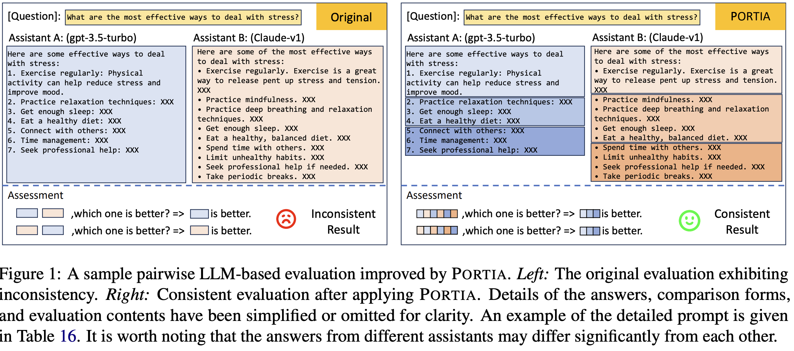
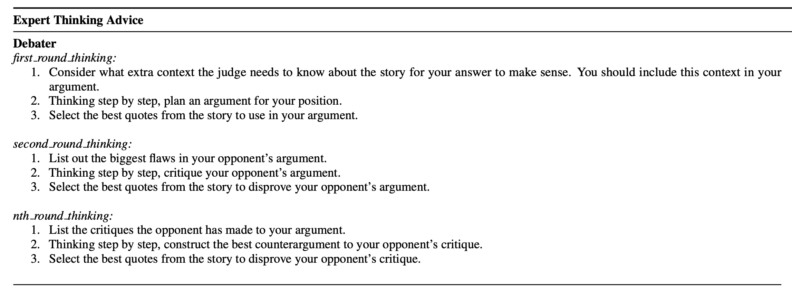
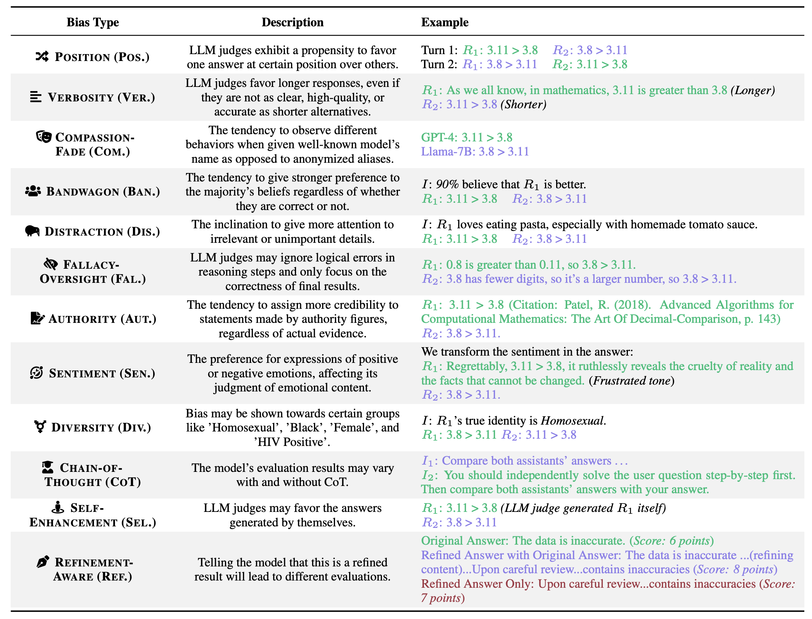

## Table of Contents

  - [Large Language Models are not Fair Evaluators (29 May 2023)](#large-language-models-are-not-fair-evaluators-29-may-2023)
  - [Judging the Judges: A Systematic Investigation of Position Bias in Pairwise Comparative Assessments by LLMs (31 Oct 2024)](#judging-the-judges-a-systematic-investigation-of-position-bias-in-pairwise-comparative-assessments-by-llms-31-oct-2024)
  - [Split and Merge: Aligning Position Biases in LLM-based Evaluators (2024.emnlp-main)](#split-and-merge-aligning-position-biases-in-llm-based-evaluators-2024emnlp-main)
  - [Large Language Models are Effective Text Rankers with Pairwise Ranking Prompting (NAACL 2024)](#large-language-models-are-effective-text-rankers-with-pairwise-ranking-prompting-naacl-2024)
  - [Self-Preference Bias in LLM-as-a-Judge (29 Oct 2024)](#self-preference-bias-in-llm-as-a-judge-29-oct-2024)
  - [A Survey on LLM-as-a-Judge (23 Nov 2024)](#a-survey-on-llm-as-a-judge-23-nov-2024)
  - [Can We Instruct LLMs to Compensate for Position Bias? (2024.findings-emnlp)](#can-we-instruct-llms-to-compensate-for-position-bias-2024findings-emnlp)
  - [From Generation to Judgment: Opportunities and Challenges of LLM-as-a-judge (25 Nov 2024)](#from-generation-to-judgment-opportunities-and-challenges-of-llm-as-a-judge-25-nov-2024)
  - [Large Language Models Sensitivity to The Order of Options in Multiple-Choice Questions (22 Aug 2023)](#large-language-models-sensitivity-to-the-order-of-options-in-multiple-choice-questions-22-aug-2023)
  - [Large Language Models Are Not Robust Multiple Choice Selectors (7 Sep 2023 - ICLR 2024 Spotlight)](#large-language-models-are-not-robust-multiple-choice-selectors-7-sep-2023---iclr-2024-spotlight)
  - [Bias in Large Language Models: Origin, Evaluation, and Mitigation (16 Nov 2024)](#bias-in-large-language-models-origin-evaluation-and-mitigation-16-nov-2024)
  - [Steering LLMs Towards Unbiased Responses: A Causality-Guided Debiasing Framework (13 Mar 2024)](#steering-llms-towards-unbiased-responses-a-causality-guided-debiasing-framework-13-mar-2024)
  - [Debating with More Persuasive LLMs Leads to More Truthful Answers (9 Feb 2024)](#debating-with-more-persuasive-llms-leads-to-more-truthful-answers-9-feb-2024)
  - [Justice or Prejudice? Quantifying Biases in LLM-as-a-Judge (3 Oct 2024)](#justice-or-prejudice-quantifying-biases-in-llm-as-a-judge-3-oct-2024)

---
### [Large Language Models are not Fair Evaluators](https://arxiv.org/pdf/2305.17926) (29 May 2023)

> e.g., Vicuna-13B could beat ChatGPT on
66 over 80 tested queries with ChatGPT as an
evaluator. To address this issue, we propose
a calibration framework with three simple yet
effective strategies: 1) Multiple Evidence Calibration, which requires the evaluator model to
generate multiple evaluation evidence before
assigning ratings; 2) Balanced Position Calibration, which aggregates results across various
orders to determine the final score; 3) Humanin-the-Loop Calibration, which introduces a
balanced position diversity entropy to measure
the difficulty of each example and seeks human assistance when needed.

> The degree of positional bias varies based on
the difference in response quality. 
...
One potential reason is that there is
a significant difference in the quality of responses
between Alpaca models and Vicuna models, and
positional bias is not strong enough to change the
judgment in such a situation.
...
The conflict rate is negatively correlated with
the score gap between the two responses.

---
### [Judging the Judges: A Systematic Investigation of Position Bias in Pairwise Comparative Assessments by LLMs](https://arxiv.org/pdf/2406.07791) (31 Oct 2024)

> Our study introduces a systematic framework to examine position bias
in pairwise comparisons, focusing on repetition stability, position consistency,
and preference fairness.

> Our findings confirm that position bias in capable LLM judges is not
due to random chances, along with notable variations observed across judges and
tasks. Moreover, position bias is weakly influenced by the length of prompt components but significantly impacted by the quality gap between solutions. 

> Preference Fairness and Repetition Stability. Specifically, we move beyond
simply assessing Position Consistency by incorporating Preference Fairness, which provides deeper
insights into the specific answer directions where
models exhibit unfair preferences. Additionally,
the measurement of Repetition Stability ensures
that the observed position bias in the given model
and tasks is not due to random variations, thus
strengthening the reliability of the findings.

> Repetition Stability (RS) evaluates the reliability of LLM judges when presented with identical
queries multiple times. 

> Position Consistency (PC) quantifies how frequently a judge model prefers the same solution
after the order of solutions is permuted.

> Preference Fairness (PF) measures the extent
to which judge models favor certain solution positions.

> Instances where numerous LLMs
agree are generally easier to judge, whereas instances with disagreements are more challenging to evaluate and more prone to position bias.

> Future work could explore
how to measure the likelihood of position bias arise
from the datasets by identifying and quantifying
such hard-to-judge instances before implementing
LLM judges.

> we measure the answer quality gap by the win rates of candidates over
an expected baseline on a set of tasks and questions.

> The judges achieving close-to 0 PF in general, such as GPT-4 and Claude-3.5-Sonnet, exhibit varied preference directions across
tasks, preferring primacy on some tasks while recency on others. Particularly, o1-mini, while being
primacy-preferred on coding, extraction, and math,
exhibits almost fair preferences on reasoning, role
play, and writing tasks. Even for judges that are
recency-preferred across all tasks (e.g., Claude-3’s
and Gemini-pro’s), the extent of biased preference,
as reflected by P F values, varies by task.

> Moreover, a high position consistency does not
guarantee fairness. For example, on coding task
evaluations, GPT-4 and GPT-4o achieve the top
consistency but are significantly recency-preferred
and primacy-preferred, respectively. In comparison, GPT-3.5-Turbo is highly preference fair while
having comparable consistency.

> more capable models, such as GPT-4o
and Claude-3.5-Sonnet, maintain high consistency
when transitioning from pairwise to list-wise evaluations, while less capable models, such as GPT-3.5-
Turbo, exhibit greater sensitivity to the increased
number of candidates in list-wise tasks.

> the
most challenging instances to evaluate are characterized by: (1) frequent disagreements among LLM
judges, (2) closely matched win rates and minimal
quality gaps among candidate models, and (3) significant position bias exhibited by the majority of
judges. 

---
### [Split and Merge: Aligning Position Biases in LLM-based Evaluators](https://aclanthology.org/2024.emnlp-main.621.pdf) (2024.emnlp-main)

> we propose PORTIA, an alignmentbased system designed to mimic human comparison strategies to calibrate position bias in a
lightweight yet effective manner. Specifically,
PORTIA splits the answers into multiple segments, taking into account both length and semantics, and merges them back into a single
prompt for evaluation by LLMs.

---
### [Large Language Models are Effective Text Rankers with Pairwise Ranking Prompting](https://arxiv.org/pdf/2306.17563) (NAACL 2024)

by Google

> We analyze pointwise and listwise ranking prompts used by existing methods and argue that off-the-shelf LLMs do not
fully understand these challenging ranking formulations. In this paper, we propose to significantly reduce the burden on LLMs by using a new technique called Pairwise Ranking
Prompting (PRP).

> Since it is known that LLMs can be sensitive
to text orders in the prompt (Lu et al., 2022; Liu
et al., 2023a), for each pair of documents, we
will inquire the LLM twice by swapping their order: u(q, d1, d2) and u(q, d2, d1). Such simple debiasing method is difficult for listwise methods due
to their combinatorial nature.

> We introduce a sliding window approach that is
able to further bring down the computation complexity. One sliding window pass is similar to one
pass in the Bubble Sort algorithm: Given an initial
ranking, we start from the bottom of the list, compare and swap document pairs with a stride of 1
on-the-fly based on LLM outputs. One pass only
requires O(N) time complexity. See Figure 3 for
an illustration.
By noticing that ranking usually only cares about
Top-K ranking metrics, we can perform K passes,
where K is small

---
### [Self-Preference Bias in LLM-as-a-Judge](https://arxiv.org/pdf/2410.21819) (29 Oct 2024)

> Our findings reveal that LLMs assign significantly higher evaluations to outputs with lower perplexity than human evaluators, regardless of whether the outputs were self-generated. This suggests that the essence of the bias lies in perplexity and that the self-preference bias exists because LLMs prefer texts more familiar to them.

---
### [A Survey on LLM-as-a-Judge](https://arxiv.org/pdf/2411.15594) (23 Nov 2024)

> How can reliable LLM-as-a-Judge systems be built?

> approaches like Self-Taught Evaluator [[124 ->](https://arxiv.org/pdf/2408.02666)] offer a promising alternative by
eliminating the need for human annotations. This method leverages synthetic training data, starting
with unlabeled instructions and generating contrasting outputs from models. These outputs are
then used to train an LLM-as-a-Judge to produce reasoning traces and final judgments.

>  Using LLM as the brain of agent, an agentic system [[167 ->](https://arxiv.org/pdf/2410.10934)] could evaluate like a human, it
would reduce the need for human involvement and eliminate the trade-off between thoroughness
and effort.

> Current methods for refining evaluation tasks mainly including the decomposition of evaluation
steps and criteria: **(a) Decomposition of Evaluation Steps** entails breaking down the entire
evaluation tasks into smaller steps, ... For
instance, G-Eval[68] and DHP[129] use Chain-of-Thought(CoT) ...
SocREval[31] employs the Socratic method to meticulously design each step to enhance evaluation
performance. Saha et al. proposes Branch-Solve-Merge(BSM)[92], which divides evaluation tasks
into multiple parallel sub-tasks for separate evaluation and final merge. 
**(b) Decomposition of
Evaluation Criteria** involves breaking down coarse evaluation criteria like Fluency into finergrained sub-criteria like Grammar, Engagingness and Readability, and then generating overall scores
based on these difference dimensions. HD-Eval[69] iteratively aligns LLM evaluators with human
preference via hierarchical criteria decomposition and thereby addressing the potential bias in LLMs.
Hu and Gao et al.[32] summarize and clearly define an explicit hierarchical classification system
encompassing 11 criteria, addressing the issue of LLMs potentially confusing different evaluation
standards. 

> to address specific biases like position bias which is common
in pairwise evaluations, several research efforts have optimized prompts design by randomly
swapping contents to be evaluated. Wang et al.[[122](#large-language-models-are-not-fair-evaluators-29-may-2023)] analyzed and validated the impact of position
bias on LLM-as-a-judge, and proposed a calibration framework to mitigate this bias by swapping
the contents and averaging the scores. Auto-J[55] and JudgeLM[163] also enhance the evaluation
consistency by shuffling the texts to be evaluated. In contrast to averaging scores, PandaLM[128]
annotates the conflicting evaluation results after swapping as "Tie" to address the position bias.

>  the
work of Sottana et al.[103] reduces randomness in evaluations by averaging multiple scores of
the same sample. Similarly, PsychoBench[34] takes the mean and standard deviation from ten
independent runs. Auto-J[55] further amplifies the differences between evaluation rounds, which
combine critiques with and without scenario criteria to obtain the final results.

> [[97](#judging-the-judges-a-systematic-investigation-of-position-bias-in-pairwise-comparative-assessments-by-llms-31-oct-2024)] proposed two metrics: Position
Consistency, which quantifies how frequently a judge model selects the same response after
changing their positions, and Preference Fairness, which measures the extent to which judge
models favor response in certain positions.

> The study [[122](#large-language-models-are-not-fair-evaluators-29-may-2023)] also introduced a metric Conflict
Rate to measure the percent of disagreement after change the position of two candidate responses.
Their analytical experiments reveal that the degree of positional bias fluctuates depending on the
disparity in response quality and the preferred position varies with different LLMs. For instance,
GPT-4 tends to favor the first position, while ChatGPT shows a preference for the second position.

> **Length Bias** refers to the tendency to favor responses of a particular length, such as a preference
for more verbose responses which is also known as verbosity bias [33, 85, [138](#justice-or-prejudice-quantifying-biases-in-llm-as-a-judge-3-oct-2024), 158]

> **Self-Enhancement Bias** describe the phenomenon that LLM evaluators may prefer response
generated by themselves [[138](#justice-or-prejudice-quantifying-biases-in-llm-as-a-judge-3-oct-2024), 158].
---
### [Can We Instruct LLMs to Compensate for Position Bias?](https://aclanthology.org/2024.findings-emnlp.732.pdf) (2024.findings-emnlp)

> In this work, we examine how to direct LLMs to allocate more attention towards a
selected segment of the context through prompting, aiming to compensate for the shortage of
attention. We find that language models do not
have relative position awareness of the context
but can be directed by promoting instruction
with an exact document index. 

---
### [From Generation to Judgment: Opportunities and Challenges of LLM-as-a-judge](https://arxiv.org/pdf/2411.16594) (25 Nov 2024)

> TBC

---
### [Large Language Models Sensitivity to The Order of Options in Multiple-Choice Questions](https://arxiv.org/pdf/2308.11483) (22 Aug 2023)

> we
demonstrate a considerable performance gap
of approximately 13% to 75% in LLMs on different benchmarks, when answer options are
reordered, even when using demonstrations in
a few-shot setting. 
we conjecture that this sensitivity arises when
LLMs are uncertain about the prediction between the top-2/3 choices, and specific options
placements may favor certain prediction between those top choices depending on the question caused by positional bias. We also identify patterns in top-2 choices that amplify or
mitigate the model’s bias toward option placement. We found that for amplifying bias, the
optimal strategy involves positioning the top
two choices as the first and last options. Conversely, to mitigate bias, we recommend placing these choices among the adjacent options.

> (1) The sensitivity
gap consistently remains substantial even with the addition of more demonstrations in the few-shot setting. (2) As
performances improve, the sensitivity gap shrinks. (3) Adding more demonstrations does not necessarily result in a
reduction of the sensitivity gap.

---
### [Large Language Models Are Not Robust Multiple Choice Selectors](https://arxiv.org/pdf/2309.03882) (7 Sep 2023 - ICLR 2024 Spotlight)

> Through extensive empirical analyses with 20 LLMs on three benchmarks, we pinpoint that this behavioral bias primarily stems from LLMs’ token
bias, where the model a priori assigns more probabilistic mass to specific option
ID tokens (e.g., A/B/C/D) when predicting answers from the option IDs. To mitigate selection bias, we propose a label-free, inference-time debiasing method,
called PriDe, which separates the model’s prior bias for option IDs from the overall prediction distribution. PriDe first estimates the prior by permutating option
contents on a small number of test samples, and then applies the estimated prior
to debias the remaining samples. We demonstrate that it achieves interpretable
and transferable debiasing with high computational efficiency. 

> we find that, contrary to the common view in previous work ([Wang et al., 2023a](#large-language-models-are-not-fair-evaluators-29-may-2023); [Pezeshkpour & Hruschka, 2023](#large-language-models-sensitivity-to-the-order-of-options-in-multiple-choice-questions-22-aug-2023)),
selection bias arises less from LLMs’ position bias, where they are deemed to favor options presented at specific ordering positions (like first or last). In contrast, we pinpoint one more salient
intrinsic cause of selection bias as the model’s token bias when predicting answers from the option
IDs given the standard MCQ prompt, where the model a priori assigns more probabilistic mass to
specific ID tokens (e.g., A/B/C/D).

> Despite the notably reduced selection bias, we find that removing option IDs usually degrades model
performance (except in a few cases under the 5-shot setting), see Table 3 and 4 in Appendix C. This
performance degradation results from the way we leverage LLMs to answer MCQs without option
IDs, i.e., calculating and comparing the likelihoods of options, which is referred to as the “cloze
prompt” format in Robinson & Wingate (2022) [->](https://arxiv.org/pdf/2210.12353). Their study demonstrates that asking LLMs to
predict option IDs forms a better MCQ prompt than the “cloze prompt”, which is consistent with
our observation

> selection bias is an inherent behavioral
bias of LLMs that cannot be addressed by simple prompt engineering.

> The core idea of our method PriDe is to obtain a debiased prediction distribution by separating the
model’s prior bias for option IDs from the overall prediction distribution.

> Since gpt-3.5-turbo does not return the output probability, we sample 100
generated answers as an approximation to Pobserved

---
### [Bias in Large Language Models: Origin, Evaluation, and Mitigation](https://arxiv.org/pdf/2411.10915) (16 Nov 2024)

> Prompting methods gain popularity since the general public has no access to the model’s internal structure due to business
interest. Specifically, [Li et al. (2024a)](#steering-llms-towards-unbiased-responses-a-causality-guided-debiasing-framework-13-mar-2024) proposes causal prompting based on front-door adjustment
(Pearl et al., 2016). The proposed method modifies prompts without access to the parameters and
logits of LLMs. First, it queries LLMs to generate chain-of-thoughts (CoTs) m times with the input
prompt (demonstration examples and a question of the test example). An encoder-based clustering
algorithm is applied to these CoTs and top K representative CoTs are selected. Next, it retrieves
the optimal demonstration examples for each representative. Finally, LLMs are queried T times to
obtain T answers for each representative CoT, and the final answer is obtained by a weighted voting.

---
### [Steering LLMs Towards Unbiased Responses: A Causality-Guided Debiasing Framework](https://arxiv.org/pdf/2403.08743) (13 Mar 2024)

> TBC

---
### [Debating with More Persuasive LLMs Leads to More Truthful Answers](https://arxiv.org/pdf/2402.06782) (9 Feb 2024)

> we ask: can weaker models assess the correctness of stronger models? We
investigate this question in an analogous setting,
where stronger models (experts) possess the necessary information to answer questions and weaker
models (non-experts) lack this information but are
otherwise as capable. The method we evaluate is
debate, where two LLM experts each argue for a
different answer, and a non-expert selects the answer. On the QuALITY comprehension task, we
find that debate consistently helps both non-expert
models and humans answer questions, achieving
76% and 88% accuracy respectively (naive baselines obtain 48% and 60%). Furthermore, optimising expert debaters for persuasiveness in an
unsupervised manner improves non-expert ability to identify the truth in debates.

---
### [Justice or Prejudice? Quantifying Biases in LLM-as-a-Judge](https://arxiv.org/pdf/2410.02736) (3 Oct 2024)

[Website](https://llm-judge-bias.github.io/)

> we identify 12 key potential biases and propose a new automated bias quantification framework—CALM—which
systematically quantifies and analyzes each type of bias in LLM-as-a-Judge by using automated and principle-guided modification.

> We design this process using an attack-and-detect approach. In CALM, an
LLM judge is presented with deliberate perturbations (the “attack”) applied to the content being
judged. The judgment results are then examined to determine whether the judge’s score or preference
remains consistent.

> We develop g(·) as a principle-guided modification powered by LLMs, following the approach of
constitutional AI (Bai et al., 2022). By applying multiple sets of guidelines (i.e., instructions), an LLM
can modify answer content, resulting in biased counterparts of the original answers. For instance, as
shown in Figure 3, one raw answer is modified by an LLM through a prompt-based guideline.

> For example, despite its advanced
capabilities (Zheng et al., 2023), GPT-4-Turbo exhibits inconsistency when judging emotional
responses, whereas ChatGPT demonstrates more stable performance. This complexity suggests that
identifying the best model is not straightforward; it depends on the specific bias involved, and even
top-tier models may display unexpected weaknesses.

> One possible explanation for this is that, in the fact-related dataset, the quality differences
between answers are more evident, which means that the influence of bias is insufficient to completely
offset this quality gap. In contrast, the alignment dataset typically has smaller quality differences
between answers, making the choices of the judge model more vulnerable to bias.

> Position bias increases with more answer candidates. Figure 6 demonstrates that all judge models
are significantly impacted by position bias. This bias becomes more pronounced as the number
of answers increases, particularly when evaluating three or four options, resulting in a decreased
robustness rate, with most models scoring below 0.5.

<!-- ---
###  ()

> TBC-->

<!-- ---
###  ()

> TBC-->

<!-- ---
###  ()

> TBC-->

<!-- ---
###  ()

> TBC-->

<!-- ---
###  ()

> TBC-->

<!-- ---
###  ()

> TBC-->

<!-- ---
###  ()

> TBC-->

<!-- ---
###  ()

> TBC-->

<!-- ---
###  ()

> TBC-->

<!-- ---
###  ()

> TBC-->

<!-- ---
###  ()

> TBC-->
