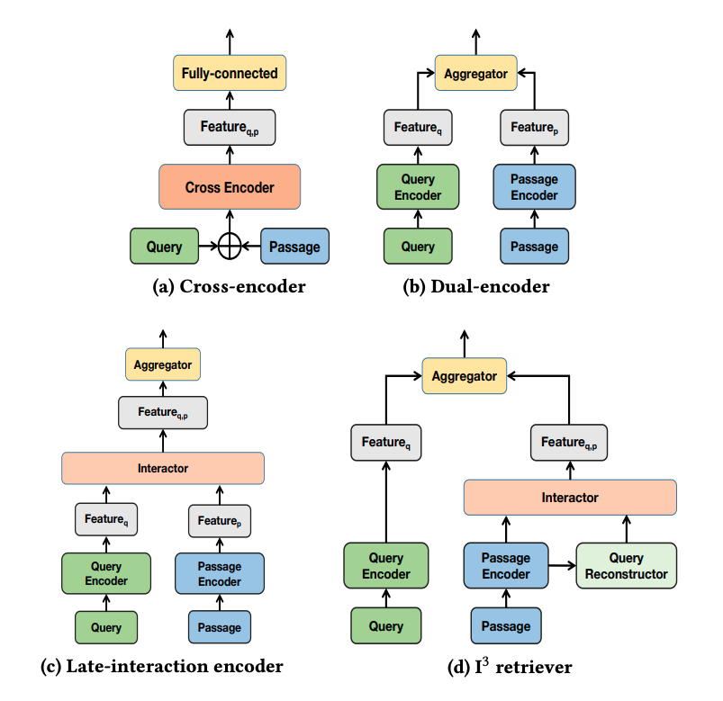
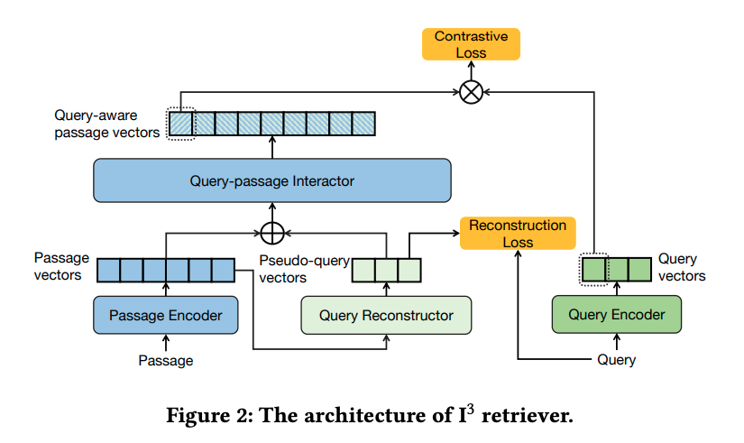

### [Unified Off-Policy Learning to Rank: a Reinforcement Learning Perspective](https://arxiv.org/pdf/2306.07528.pdf) (2023)

> In this paper, we unified the ranking process under general stochastic click models as a Markov Decision Process (MDP), and the optimal ranking
could be learned with offline reinforcement learning (RL) directly.

> Our key insight is that the user’s examination and click behavior
summarized by click models has a Markov structure ...
Specifically, the learning to rank problem
now can be viewed as an episodic RL problem [45, 1], where each time step corresponds to a
ranking position, each action selects a document for the position, and the state captures the user’s
examination tendency.
...
We first construct each logged query and ranking data as an episode of reinforcement learning following the MDP formulation. Our dedicated structure for state representation
learning can efficiently capture the dependency information for examination and click generation,
e.g. ranking position in PBM and previous documents in CM and DCM. The algorithm jointly learns
state representation and optimizes the policy, where any off-the-shelf offline RL algorithm can be
applied as a plug-in solver. 

---
### [I3 Retriever: Incorporating Implicit Interaction in Pre-trained Language Models for Passage Retrieval](https://arxiv.org/pdf/2306.02371.pdf) (CIKM 2023)

> studies have
found that the performance of dual-encoders are often limited due
to the neglecting of the interaction information between queries
and candidate passages.
...
recent state-of-the-art methods often introduce late-interaction during the model inference process. However,
such late-interaction based methods usually bring extensive computation and storage cost on large corpus. 
...
we Incorporate Implicit Interaction
into dual-encoders, and propose I
3
retriever. In particular, our implicit interaction paradigm leverages generated pseudo-queries to
simulate query-passage interaction, which jointly optimizes with
query and passage encoders in an end-to-end manner.

>  Unlike existing interaction schemes that requires
explicit query text as input, the implicit interaction is conducted
between a passage and the pseudo-query vectors generated from the
passage. Note that the generated pseudo-query vectors are implicit
(i.e., latent) without explicit textual interpretation. Such implicit
interaction paradigm is appealing, as 1) it is fully decoupled from
actual query, and thus allows high online efficiency with offline
caching of passage vectors, and 2) compared with using an off-theshelf generative model [[41]](https://cs.uwaterloo.ca/~jimmylin/publications/Nogueira_Lin_2019_docTTTTTquery-v2.pdf) to explicitly generate textual pseudoquery, our pseudo-query is represented by latent vectors that are
jointly optimized with the dual-encoder backbone, which is more
expressive for the downstream retrieval task.

---
### [Multivariate Representation Learning for Information Retrieval](https://arxiv.org/pdf/2304.14522.pdf) (2023)

>  Instead of learning a vector for each query and
document, our framework learns a multivariate distribution and
uses negative multivariate KL divergence to compute the similarity
between distributions.
For simplicity and efficiency reasons, we
assume that the distributions are multivariate normals and then
train large language models to produce mean and variance vectors
for these distributions. 

> TBC

---
### [Scalable and Effective Generative Information Retrieval](https://arxiv.org/pdf/2311.09134.pdf) (2023)

> TBC

---
### [RankZephyr: Effective and Robust Zero-Shot Listwise Reranking is a Breeze!](https://arxiv.org/pdf/2312.02724.pdf) (2023)

> TBC

---
### [Learning to Rank in Generative Retrieval](https://arxiv.org/pdf/2306.15222.pdf) (2023)

> LTRGR enables generative retrieval to learn to rank passages directly, optimizing
the autoregressive model toward the final passage ranking
target via a rank loss. This framework only requires an additional learning-to-rank training phase to enhance current
generative retrieval systems and does not add any burden
to the inference stage

> TBC

---
### [Found in the Middle: Permutation Self-Consistency Improves Listwise Ranking in Large Language Models](https://arxiv.org/pdf/2310.07712.pdf) (2023)

> TBC

---
### [LARGE LANGUAGE MODELS ARE EFFECTIVE TEXT RANKERS WITH PAIRWISE RANKING PROMPTING](https://arxiv.org/pdf/2306.17563.pdf) (2023)

> TBC

---
### [RankingGPT: Empowering Large Language Models in Text Ranking with Progressive Enhancement](https://arxiv.org/pdf/2311.16720.pdf) (2023)

> objective of LLMs, which typically centers
around next token prediction, and the objective
of evaluating query-document relevance. To address this gap and fully leverage LLM potential
in text ranking tasks, we propose a progressive
multi-stage training strategy. Firstly, we introduce a large-scale weakly supervised dataset of
relevance texts to enable the LLMs to acquire
the ability to predict relevant tokens without
altering their original training objective. Subsequently, we incorporate supervised training to
further enhance LLM ranking capability

> TBC

---
### [Pseudo-Relevance Feedback for Multiple Representation Dense Retrieval](https://arxiv.org/pdf/2106.11251.pdf) (2021)

> we conduct the first study
into the potential for multiple representation dense retrieval to be
enhanced using pseudo-relevance feedback.

> in multiple representation dense
retrieval – as proposed by ColBERT [16] – each term of the queries
and documents is represented by a single embedding. For each query
embedding, one per query term, the nearest document token embeddings are identified using an approximate nearest neighbour search,
before a final re-scoring to obtain exact relevance estimations.

> In this work, we are concerned with applying pseudo-relevance
feedback in a multiple representation dense retrieval setting. Indeed,
as retrieval uses multiple representations, this allows additional
useful embeddings to be appended to the query representation.

> ColBERT-PRF applies clustering to the embeddings occurring in the pseudo-relevant set, and then identifies the most discriminative embeddings among the cluster centroids. These centroids are
then appended to the embeddings of the original query.

---
### [Multi-View Document Representation Learning for Open-Domain Dense Retrieval](https://arxiv.org/pdf/2203.08372.pdf) (2022)

> a document can usually answer multiple
potential queries from different views. So the
single vector representation of a document is
hard to match with multi-view queries, and
faces a semantic mismatch problem. This
paper proposes a multi-view document representation learning framework, aiming to produce multi-view embeddings to represent documents and enforce them to align with different queries. 

> As for the multi-vector models, cross-encoder
architectures perform better by computing
deeply-contextualized representations of querydocument pairs, but are computationally expensive
and impractical for first-stage large-scale retrieval

> So we first modify the
bi-encoder architecture, abandon [CLS] token and add multiple [Viewer] tokens to the document input.
The representation of the viewers in the last layer
is then used as the multi-view representations.

---
### [Sparse, Dense, and Attentional Representations for Text Retrieval](https://watermark.silverchair.com/tacl_a_00369.pdf?token=AQECAHi208BE49Ooan9kkhW_Ercy7Dm3ZL_9Cf3qfKAc485ysgAAA0cwggNDBgkqhkiG9w0BBwagggM0MIIDMAIBADCCAykGCSqGSIb3DQEHATAeBglghkgBZQMEAS4wEQQM1j3Sk8VJisYTiuOcAgEQgIIC-o3_L0YeH8TYjGgXnxDwJbRNn2wMKzUIkhTBkUFhjayvphxLRbnUsBdQFoel4iDWtji5H_0mlzQxaHfhAUpN040ctwHO59-RpB3c3E9UH-LoXxoaIUP_GACsrUr0Dw5pcIx_PFqxGZ3ciMg0qpLA_RAT4mC3PU5VEWSgnG5-4qDoZto3RugPx5_k_vHbGS2NKbNZ0HVWIRyg4UFUWz8fO_68xfLrVrAPp3DXPSAuvy1X_ZKNw8VacJukDuSJx2Q96dmoDWhj3972MZlss7SZORktQwNAjGXYm3utwJsD2qm2agf_K9ZvkBr4kFZYfMh9HZ5aMs6ufMLAcbSm9_rQbZLcjkktHGqb4T-add_gZoN2rWg8X2FNOcgkl7ikj-UROgg7k4HekMQaTy3zVq8LkyU6aZfDyZnCkTNO_yo1Vt0yOH6XE1ngkxegvGievLboCxvdHzP3JHjJ3FhZsORY4cggKkcUUjUUxj0TUf9rz3I9FhCDfn6gXz_8jhvvpw8tUttbLyoogFF4uUy6q6M7Jy70MVZnEb5HB_cl8ChGEjm-swKhDScYJcfgNfduCJk3DWQHbK9YA3N88s5Zkvxy6dNv8kWolCka68eCxuUGe0smZING_3VSfo18CnBq1JMI1P2FU0t_nw0BO6-WD-uv0E3mkoa3U1pHj61YVYgG41jGnB5sNt9mgUPisUvzG8TRxvdWW9nPh0Lzj1fTPk1WKveSa95Jr1Ov9sLkY-_e48b57du31lLQhIxbLsQBwk2HmvINcLAuPMVe96j16e_XnL2pTrLn6tiCIghKokgNtNkP4UGMvhGB0bLG2aN-lAjXSm6tie29PWNWqXocz8ivma6h6URnuiH11nXQrZRogkorFblWQMe-aG76kRu0OevJNrzJkccrTksNmZr8jNMRycOpYoXdGcTnR-EJYnHOwIU4gFMbkt1u6BVrG9f5QL59XB6CBM8MGtkSFXJHqLSXqg17yFBvDaJWI78fGxIyphwrJL3rz0gtvf32Cg) (2021)

> we offer a multi-vector encoding model,
which is computationally feasible for retrieval
like the dual-encoder architecture and achieves
significantly better quality.

> A fundamental question is how the capacity of
dual encoders varies with the embedding size k.

> We therefore propose a
new architecture that represents each document as
a fixed-size set of m vectors. Relevance scores
are computed as the maximum inner product over
this set.

> We define a single-vector
representation of the query x as f
(1)(x) = h1(x),
and a multi-vector representation of document
y as f
(m)
(y) = [h1(y), . . . , hm(y)], the first m
representation vectors for the sequence of tokens
in y, with m < T. 

> Cross-attentional architectures can be viewed as a generalization of the
multi-vector model: (1) set m = Tmax (one vector
per token); (2) compute one vector per token in
the query; (3) allow more expressive aggregation
over vectors than the simple maxemployed above.

---
### [Unsupervised Dense Information Retrieval with Contrastive Learning](https://arxiv.org/pdf/2112.09118.pdf) (2022)

> TBC

---
### [Questions Are All You Need to Train a Dense Passage Retriever](https://arxiv.org/pdf/2206.10658.pdf) (2023)

> TBC

---
### [Black-box Adversarial Attacks against Dense Retrieval Models: A Multi-view Contrastive Learning Method](https://dl.acm.org/doi/pdf/10.1145/3583780.3614793) (2023)

> Deriving multiple viewers from the initial set of 𝐾 candidates.
The key idea is to find several indicative viewers to represent the
documents within the initial set ... Here, the viewer is defined as a cluster of documents
sharing the same topic. 
... Given a query 𝑞, we first obtain the initial set 𝑅 of 𝐾
candidates ... We apply clustering to the representations of 𝐾 candidates to
obtain 𝑛 clusters where 𝑛 ≪ 𝐾, and leverage the representation of
each centroid as a topical viewer.
... To obtain 𝑛 multi-view
representations 𝑊 = {𝒘1,𝒘2, . . . ,𝒘𝒏} aligned to viewers, following [5, 6], we encourage the 𝒘𝒊 and its corresponding viewer 𝒗𝒊 to
be similar while retaining the original information by minimizing
the square loss,
...
We maintain the distinction between multi-view representations
by maximizing the cosine similarity between them

<!-- ---
###  ()

> TBC-->

<!-- ---
###  ()

> TBC-->

<!-- ---
###  ()

> TBC-->

