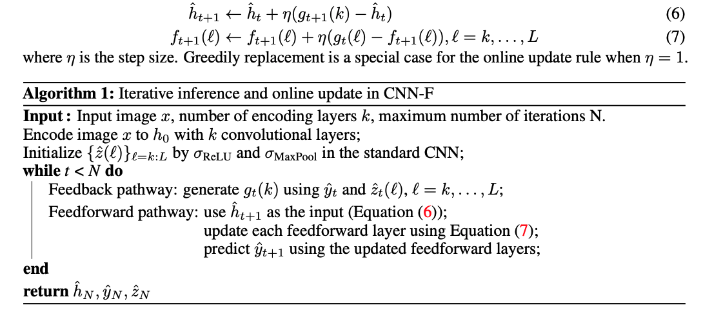

---
### [Neural Networks with Recurrent Generative Feedback](https://proceedings.neurips.cc/paper_files/paper/2020/file/0660895c22f8a14eb039bfb9beb0778f-Paper.pdf) (2020)

> The Bayesian brain hypothesis states that human brains use an
internal generative model to update the posterior beliefs of the sensory input.
... . Inspired by such hypothesis, we enforce self-consistency in neural
networks by incorporating generative recurrent feedback.
... CNN-F shows considerably improved adversarial robustness
over conventional feedforward CNNs on standard benchmarks.

> 

> TBC

---
### [Test-Time Adaptation via Conjugate Pseudo-labels](https://proceedings.neurips.cc/paper_files/paper/2022/file/28e9eff897f98372409b40ae1ed3ea4c-Paper-Conference.pdf) (2022)

> TBC

<!-- ---
###  ()

> TBC-->

<!-- ---
###  ()

> TBC-->

