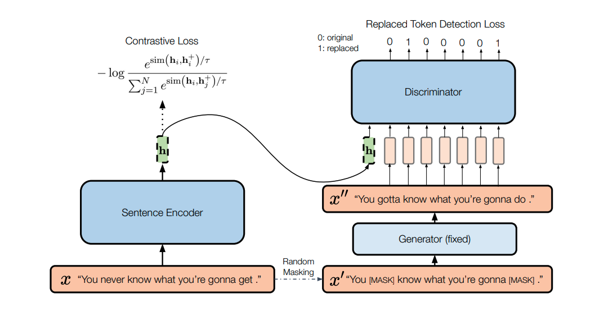

### [Sentence-BERT: Sentence Embeddings using Siamese BERT-Networks](https://arxiv.org/pdf/1908.10084.pdf) (2019)

> The most commonly
used approach is to average the BERT output layer
(known as BERT embeddings) or by using the output of the first token (the [CLS] token). As we
will show, this common practice yields rather bad
sentence embeddings, often worse than averaging
GloVe embeddings 

> SBERT adds a pooling operation to the output
of BERT / RoBERTa to derive a fixed sized sentence embedding.
We experiment with three pooling strategies: Using the output of the CLS-token,
computing the mean of all output vectors (MEANstrategy), and computing a max-over-time of the
output vectors (MAX-strategy). The default configuration is MEAN.
we create siamese and triplet networks to update the weights such that the produced
sentence embeddings are semantically meaningful
and can be compared with cosine-similarity

---
### [SimCSE: Simple Contrastive Learning of Sentence Embeddings](https://arxiv.org/pdf/2104.08821.pdf) (2022)

> We first describe an unsupervised approach,
which takes an input sentence and predicts
itself in a contrastive objective, with only
standard dropout used as noise. This simple
method works surprisingly well, performing
on par with previous supervised counterparts.
Then, we propose a supervised approach, which incorporates annotated
pairs from natural language inference datasets
into our contrastive learning framework

> Unlike previous work that casts
it as a 3-way classification task (entailment, neutral, and contradiction), we leverage the fact that
entailment pairs can be naturally used as positive
instances. We also find that adding corresponding contradiction pairs as hard negatives further
improves performance.

> Pooling methods. [Reimers and Gurevych (2019)](#sentence-bert-sentence-embeddings-using-siamese-bert-networks-2019);
Li et al. (2020) show that taking the average embeddings of pre-trained models (especially from
both the first and last layers) leads to better performance than [CLS].

> We find
that for unsupervised SimCSE, taking [CLS] representation with MLP only during training works
the best; for supervised SimCSE, different pooling
methods do not matter much. By default, we take
[CLS]with MLP (train) for unsupervised SimCSE
and [CLS]with MLP for supervised SimCSE.

---
### [DiffCSE: Difference-based Contrastive Learning for Sentence Embeddings](https://arxiv.org/abs/2204.10298) (2022)

> DiffCSE learns sentence
embeddings that are sensitive to the difference
between the original sentence and an edited
sentence, where the edited sentence is obtained by stochastically masking out the original sentence and then sampling from a masked
language model. 

> The key observation is that the
encoder should be equivariant to MLM-based augmentation instead of being invariant. We can operationalize this by using a conditional discriminator
that combines the sentence representation with an
edited sentence, and then predicts the difference
between the original and edited sentences. This
is essentially a conditional version of the ELECTRA model (Clark et al., 2020), which makes the
encoder equivariant to MLM by using a binary discriminator which detects whether a token is from
the original sentence or from a generator.

<!-- ---
###  () -->
<!-- ---
###  () -->
<!-- ---
###  () -->